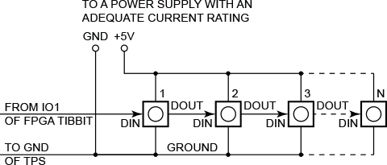

# CA-Test-Tibbit-57

###### Rolling Color

 

###### Shifting Color

 

You will need:

- TPP2, TPP2(G2), TPP3, or TPP3(G2) board
- One Tibbit #57
- One Tibbit #20
- Optionally, one Tibbit #00-3 (if you are going to power your smart LEDs from your TPS system)
- Several SK6812RGBW LEDs (or a board, or a LED strip containing these LEDs)
- Optionally, one Tibbit #10 (12V->5V regulator)
- Optionally, one Tibbit #18 (power jack)

*The last two Tibbits are necessary if you are going to power your rig from a 12V power adaptor. Alternatively you can supply regulated +5V power directly to the TPP.*

Tibbit #57 is based on the ICE5LP2K-SWG36ITR50 FPGA from Lattice Semiconductor. This FPGA is suitable for a large number of projects. One of such projects is the smart LED controller.

In the smart LED configuration, Tibbit #57 can control a string of daisy-chained SK6812RGBW LEDs. SK6812RGBW devices carry a small IC driving four onboard light emitters with red, green, blue, and white colors. Each of the color sources can be set to one of the 256 levels of brightness, meaning that four bytes of data are needed per LED.

Smart LEDs are controlled via a special 1-wire protocol. Each LED has a DIN (data in) and DOUT (data out) pins. The DIN pin of the first LED in the chain is connected to the IO1 line of the FPGA Tibbit. The DOUT of the first LED is connected to the DIN of the second LED, the DOUT of the second LED — to the DIN of the third LED, and so on.

 

 

Depending on the number of LEDs you are connecting, you may be able to power them from your TPS, or you may need to use an external +5V power supply. R, G, and B emitters of each LED consume up to 9mA each, the white emitter consumes up to 18 mA. Count the available current and choose the right power source!

Before you run the application, set the actual number of LEDs you have connected in the "Const NUM_LEDS=" line.

The test application has three modes — PATTERN_1, PATTERN_2, PATTERN_3. Select the mode in the "Dim pattern_mode as pattern_modes=" line.

PATTERN_1: All LEDs set to the same color, the color will gradually change from R to G, from G to B, and from B to R.

PATTERN_2: A moving pattern of RGB colors.

PATTERN_3: White LEDs all set to the same brightness, and the brightness gradually changes between minimum and maximum.

The longer your LED chain is, the slower the "animation" runs. If you have a small number of LEDs connected (10-20), then you may discover that everything changes too fast. In that case, increase the delay specified by the "Const LED_OUTPUT_DELAY=" line.